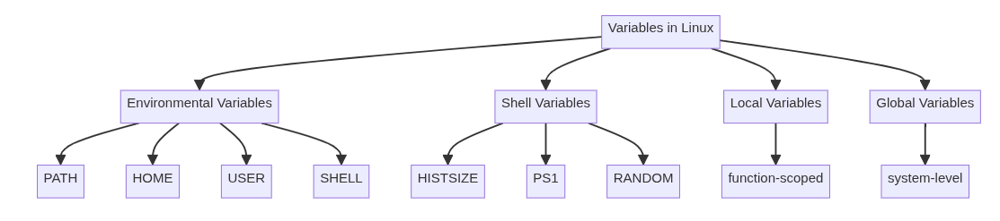

# 2.1 Command Line Basics

### **2.1 Command Line Basics**


**Weight:** 3

**Description:** Basics of using the Linux command line.

**Key Knowledge Areas:**

* Basic shell
* Command line syntax
* Variables
* Quoting

**The following is a partial list of the used files, terms and utilities:**

* Bash
* echo
* history
* PATH environment variable
* export
* type<br>

Modern operating systems, like Linux, macOS, and Windows, include efficient, aesthetically pleasing user interfaces, so it may seem odd to encourage administrators to return to the “[old fashioned](https://thenewstack.io/dr-torq-rm-r-and-other-linux-command-line-gotchas/)” command line. In reality, command-line environments are critical to administrators on any platform, especially Linux.

Command line interfaces (CLI) have several advantages over graphical user interfaces (GUI). These advantages include the following:

* **Speed**: Knowledgeable administrators often accomplish tasks far more quickly at the command line than through a GUI.
* **Performance**: Running a CLI takes fewer system resources than running a GUI. This is especially important with servers.
* **Flexibility**: Command line commands often offer more options than the GUI interface, which usually only supports the most common functions.
* **Scripting and automation**: You can write a series of commands into a text file called a script and execute it on a schedule. You cannot usually automate GUI tasks in the same way.

### Bash

Linux users may not access the CLI daily, but Linux administrators surely will. Achieving a certain amount of comfort at the command prompt is a crucial step in an administrator’s journey.

The default CLI or shell in Linux is called Bash, or the Bourne Again SHell. Operating systems have different shells, which vary by syntax, available commands, customization, etc. Linux supports many shells, but the only one you need to worry about early on is Bash.


The name is an acronym for the ‘Bourne-Again SHell’, a pun on Stephen Bourne, the author of the direct ancestor of the current Unix shell `sh`, which appeared in the Seventh Edition Bell Labs Research version of Unix.


Most users access Bash by using a terminal program that runs in the GUI.&#x20;

#### Access the Linux command line

Linux distributions make it easy to open the terminal. Most distributions today install with a GUI, though production servers often only include a CLI. Linux GUI environments vary a lot, but typically, there’ll be a shortcut bar along the edge of the desktop. This bar may have an icon for the terminal.<br>

<figure><figcaption></figcaption></figure>

### &#x20;What Does ‘Syntax’ Mean?

Remember in school when you were told about structuring sentences? Your sentences needed a noun and verb, plus the first character of the sentence should be upper case and the sentence, must end with a punctuation mark. That’s syntax — rules for written communication.

You must type in commands correctly. In addition, commands and filenames are case-sensitive. This often trips up new users, so be careful.

The Linux command line also has rules for communication, and they’re pretty different from standard sentences. There are two basic ways of issuing commands to your Linux system.

#### Command Syntax

The traditional command syntax consists of three parts: An actual command, one or more options, and an argument.

* **Command**: What you want the system to do.
* **Option**: Slight modification to how the command works.
* **Argument**: What you want the command to act on.

Arguments represent what you want the command to act on. For example, you can’t just type the command to delete a file (which is rm, by the way). You must specify what file you want deleted.

Here’s an example:

```
rm file1
```

In this example, _rm_ is the command — you want something deleted. The argument is _file1_ — that’s what you want deleted.

In this second example, you want to display the contents of a directory named /home:

```
ls /home
```

The command is _ls_ — you want to list the contents of a directory. The argument is _/home_ — the directory you want to list the contents of. This directory contains home folders for all standard users on the system.

#### Command and Subcommand Syntax

Some Linux commands allow a great amount of focus. For example, the command to display the system’s IP address is ip. However, it also uses a series of objects or subcommands to allow the command to target specific functions.

* **Command**: What you want the system to do.
* **Object/subcommand**: Additional detailed focus for the command.
* **Argument**: What you want the command to act on.

Here are examples of using the _ip_ command with two different objects:

```
ip addr
```

```
ip link show
```

The _ip addr_ example displays IP address information for each network interface. The ip link show command displays detailed information about each interface (and it happens to include the IP address assigned to that link).

### Use of Linux Commands <a href="#what-is-linux" id="what-is-linux"></a>

**Linux commands** are a type of Unix command or **shell** procedure. They are the basic tools used to interact with Linux on an individual level. Linux commands are used to perform a variety of tasks, including displaying information about files and directories.

#### &#x20;**Is** command in Linux

The ls command is commonly used to identify the files and directories in the working directory. This command is one of the many often-used Linux commands that you should know.

This command can be used by itself without any arguments and it will provide us the output with all the details about the files and the directories in the current working directory. There is a lot of flexibility offered by this command in terms of displaying data in the output.

```
[payam@earth ~]$ ls
Desktop  Documents  Downloads  kubeconf  Music  Pictures  Public  Templates  Videos
```

#### pwd command in Linux

The **pwd command** is mostly used to print the current working directory on your terminal. It is also one of the most commonly used commands.&#x20;

Now, your terminal prompt should usually include the entire directory. If it doesn't, this is a quick command to see which directory you're in. Another purpose for this command is when creating scripts because it can help us find the directory in which the script was saved. The below pictures are the output with the command.

```
[payam@earth ~]$ pwd
/home/payam
```

### cd command in Linux <a href="#id-4-cd-command-in-linux" id="id-4-cd-command-in-linux"></a>

The **cd command** is used to navigate between directories. It requires either the full path or the directory name, depending on your current working directory. If you run this command without any options, it will take you to your home folder.&#x20;

```
[payam@earth ~]$ cd /home/payam/Downloads/
```

### echo command in Linux <a href="#id-18-echo-command-in-linux" id="id-18-echo-command-in-linux"></a>

**echo command** in Linux is specially used to print something in the terminal

```
[payam@earth ~]$ echo "Hello World"
Hello World
```

However, the echo command can do much more than just printing text. It’s used to print  variables, and special characters to the standard output, which is usually the terminal.\
It can also be used to create files and directories, test and debug scripts and commands, format and display messages, and generate output for other commands or programs.

## types of variables in Linux

In the Linux operating system, there are several types of variables that serve different purposes. These variables can be categorized into the following main types:


* Environmental Variables
* Shell Variables
* Local Variables
* Global Variables

Now lets have an over view about each one:

#### Environmental Variables <a href="#environmental-variables" id="environmental-variables"></a>

Environmental variables are system-wide variables that store information about the user's shell environment. They are accessible to all processes and programs running on the system. Examples of environmental variables include:

* `PATH`: Specifies the directories where the shell should search for executable files.
* `HOME`: Represents the user's home directory.
* `USER`: Stores the username of the current user.
* `SHELL`: Indicates the default shell used by the current user.


#### Display Variable <a href="#display-variable" id="display-variable"></a>

The command echo “$variable” is used to print the value of a variable to the standard output. A variable is a name that represents some data stored in the memory. The $ symbol is used to access the value of a variable.

For example, $USER is a predefined variable that holds the name of the current user. To print the value of $USER, use echo “$USER”. This will display the current user name on the terminal screen.


Lets use echo command to see values of them:

```
[payam@earth ~]$ echo $PATH
/home/payam/.local/bin:/home/payam/bin:/usr/local/bin:/usr/local/sbin:/usr/bin:/usr/sbin
[payam@earth ~]$ echo $HOME
/home/payam
[payam@earth ~]$ echo $USER
payam
[payam@earth ~]$ echo $SHELL
/bin/bash
```

Environmental variables can be set, modified, and accessed using the `export` command in the shell.&#x20;


## How to Display Path of an Executable File in Linux ?

In Linux finding the exact path of an excutable file can be crucial for the system adminstration, scripting and as well for troubleshooting. The `which` command helps with providing a simple and effective way to locate the executable files within the directories that are listed in your system.

The \`which\` command in Linux is used to locate the executable file associated with a given command. When you enter a command in the terminal, \`which\` helps identify which executable file will be executed when that command is invoked. It searches through directories listed in the user's \`PATH\` environment variable and returns the path of the first executable file it finds that matches the specified command. This command is particularly useful for troubleshooting and understanding the execution flow of commands within the Linux operating system.

The basic syntax of the `which` command in Linux is straightforward. It follows the following format:<br>

```
which [filename1] [filename2] ...
```

example:

```
[payam@earth ~]$ which pwd
/usr/bin/pwd
```


#### export&#x20;

In Bash, environment variables are set when you start a new shell session, and changes to these variables are not automatically picked up by the shell. The export command allows you to update and propagate the values of environment variables to the current session and any spawned child processes, ensuring that changes are immediately effective. This feature is crucial for tasks such as setting up paths, configuring environment-specific variables, or defining settings that multiple programs need to access.

```
export [-f] [-n] [name[=value] ...] or export -p
```

<figure><figcaption></figcaption></figure>

#### Shell Variables <a href="#shell-variables" id="shell-variables"></a>

Shell variables are specific to the current shell session and are not accessible to other processes. They are used to store temporary values and settings for the shell itself. Examples of shell variables include:

* `HISTSIZE`: Determines the maximum number of commands stored in the history.
* `PS1`: Defines the primary prompt string.
* `RANDOM`: Generates a random number each time it is referenced.

Shell variables can be set and accessed using the `=` operator. For example, to set the `MYVAR` shell variable to the value `"Hello, World!"`, you can use the following command:

```
[payam@earth ~]$ MYVAR="Hello, World!"
[payam@earth ~]$ 
[payam@earth ~]$ echo $MYVAR
Hello, World!
```

#### Local Variables <a href="#local-variables" id="local-variables"></a>

Local variables are variables that are specific to a particular script or function. They are only accessible within the scope in which they are defined. Local variables are typically used to store temporary values that are needed within a specific context. Here's an example of defining a local variable in a Bash script:

```
#!/bin/bash

function greet() {
    local name="Alice"
    echo "Hello, $name!"
}

greet
```

In this example, the `name` variable is a local variable that is only accessible within the `greet()` function.<br>

#### Global Variables <a href="#global-variables" id="global-variables"></a>

Global variables are variables that are accessible throughout the entire system, including all scripts and processes. They are typically defined at the system level or by the operating system. Global variables are less common than environmental or shell variables, and they are usually reserved for system-level configurations or critical application settings.

<figure><figcaption></figcaption></figure>

In summary, Linux has several types of variables that serve different purposes. Environmental variables are system-wide, shell variables are specific to the current shell session, local variables are scoped to a particular script or function, and global variables are accessible throughout the entire system. Understanding the different types of variables and how to work with them is an essential part of Linux system administration and shell scripting.

### **history Command in Linux**

The **`history` command** in **Linux** displays a list of commands that were previously entered in the terminal. By default, it shows the last **1000 commands**, but this can be configured. This feature allows users to recall, reuse, and modify commands without having to retype them. The command history is stored in a file, typically **`~/.bash_history`** for the Bash shell.

To view the command history, simply type:

```
[root@earth ~]# history 
    1  dnf update
    2  dnf install epel-release-9-7.el9.noarch 
    3  dnf group install "Workstation"
    4  systemctl  get-default 
    5  systemctl  set-default  graphical.target 
    6  reboot
    7  lsblk
    8  blkid
    9  ls /data/
   10  . . . .

```

Here, the number (termed as event number) preceded before each command depends on the system. You may get different numbers while executing on your own system.\
To show the limited number of commands that executed previously as follows:

```
[root@earth ~]# history 5
  292  dnf install ksnip
  293  dnf remove knip
  294  dnf remove ksnip
  295  history 
  296  history 5

```

We can also use arrow keys to go back and froward between previously commands. Also it is good to know that we can use `history -c` to clear history, altough it is not what we usually do.

***

### Different Types of Shell Commands

In Linux, there are several types of commands, and for a new Linux user, knowing the meaning of different commands enables efficient and precise usage.


One important thing to note is that the command line interface is different from the shell, it only provides a means for you to access the shell. The shell, which is also programmable then makes it possible to communicate with the kernel using commands.


Different classifications of Linux commands fall under the following classifications:

### 1. Program Executables (File System Commands)

When you run a command, Linux searches through the directories stored in the `$PATH` environmental variable from left to right for the executable of that specific command.<br>

```
[payam@earth ~]$ echo $PATH
/home/payam/.local/bin:/home/payam/bin:/usr/local/bin:/usr/local/sbin:/usr/bin:/usr/sbin
```

In the above order, the directory `/home/payam/bin` will be searched first followed by `/usr/local/sbin` and so on, the order is significant in the search process.

```
[payam@earth ~]$ ll /usr/local/bin/
total 4
-rwxr-xr-x. 1 root root 208 Nov 30 11:06 flask
```

### 2. Linux Aliases

These are user-defined commands, they are created using the alias shell built-in command and contain other shell commands with some options and arguments. The idea is to basically use new and short names for lengthy commands.

The syntax for creating an **alias** is as follows:

```
alias newcommand='command -options'
```

To list all **aliases** on your system, issue the command below:

```
[payam@earth ~]$ alias  -p
alias egrep='egrep --color=auto'
alias fgrep='fgrep --color=auto'
alias grep='grep --color=auto'
alias l.='ls -d .* --color=auto'
alias ll='ls -l --color=auto'
alias ls='ls --color=auto'
alias spyder='/home/payam/.local/spyder-6/envs/spyder-runtime/bin/spyder'
alias uninstall-spyder='/home/payam/.local/spyder-6/uninstall-spyder.sh'
alias xzegrep='xzegrep --color=auto'
alias xzfgrep='xzfgrep --color=auto'
alias xzgrep='xzgrep --color=auto'
alias zegrep='zegrep --color=auto'
alias zfgrep='zfgrep --color=auto'
alias zgrep='zgrep --color=auto'
```


the aliases we have created above only work temporarily when the system is restarted, they will not work after the next boot. Later we will see how we can set permanent aliases in our system.


### 3. Linux Shell Reserved Words

In shell programming, words such as **if**, **then**, **fi**, **for**, **while**, **case**, **esac**, **else**, **until,** and many others are shell-reserved words. As the description implies, they have specialized meaning to the shell.

list of all Linux shell keywords:

```
if then fi for while case esac else until
```

### 4. Linux Shell Functions

A shell function is a group of commands that are executed collectively within the current shell. Functions help to carry out a specific task in a shell script. The conventional form of writing shell functions in a script is:

```
function_name() {
command1
command2
…….
}
```

### 5. Linux Shell Built-in Commands

There are Linux commands built into the shell, so you won’t find them within the file system. They include **`pwd`**, **`cd`**, **`bg`**, **`alias`**, **`history`**, **`type`**, **`source`**, **`read`**, **`exit`**, and many others.

You can list or check Linux built-in commands using `type` command

### type command in Linux

The **type** command in Linux is a useful utility for identifying how the shell will interpret a given command. It provides information on whether a command is a shell built-in, external binary, function, or alias, helping users understand the source of the command and its behavior. The command is particularly helpful when troubleshooting or exploring system utilities, as it reveals whether a command is being executed as an alias, keyword, or a binary file from the disk.\
**Syntax**

```
type [Options] command names
```

Basic 'type' command Example:

```
[root@earth ~]# type type
type is a shell builtin
```

#### **Key Options of the type Command**

**`-a` :  Show All Locations (Aliases, Keywords, Functions, Executable Files)**

This option is used to find out whether it is an alias, keyword or a function and it also displays the path of an executable, if available. **Example:**

```
[payam@earth ~]$ type pwd
pwd is a shell builtin
[payam@earth ~]$ type -a  pwd
pwd is a shell builtin
pwd is /usr/bin/pwd
[payam@earth ~]$ 
```

**`-t` : Display a Single Word Indicating Command Type**

The '-t' option will return a single word that describes the type of the command. It simplifies the output by focusing only on the category of the command: alias, keyword, builtin, function, or file. **Example:**

```
[payam@earth ~]$ type -t pwd
builtin
[payam@earth ~]$ type -t cp
file
[payam@earth ~]$ type -t while
keyword
[payam@earth ~]$ type -t ls
alias

```

* **alias:** if command is a shell alias
* **keyword:** if command is a shell reserved word
* **builtin:** if command is a shell builtin
* **function:** if command is a shell function
* **file:** if command is a disk file

**`-p` :** **Display the Path to the Executable File**

This option displays the name of the disk file which would be executed by the shell. It will return nothing if the command is not a disk file. **Example:**

```
[payam@earth ~]$ type -p dash
/bin/dash
[payam@earth ~]$
```

If **dash** exists as an executable on the disk, it shows the path where it's located.

> The '**type'** command in Linux is a versatile tool that helps users and system administrators gain insights into how commands are interpreted by the shell. '**type'** makes it easy to understand the source of a command’s behavior, whether you’re trying to figure out if a command is a built-in or external executable, or debugging an alias.

that's all.

.

.

.

***

source:\
[https://thenewstack.io/tns-linux-sb00-3-understand-the-linux-command-line/](https://thenewstack.io/tns-linux-sb00-3-understand-the-linux-command-line/)\
[https://www.geeksforgeeks.org/linux-unix/basic-linux-commands/](https://www.geeksforgeeks.org/linux-unix/basic-linux-commands/)

[https://labex.io/questions/what-are-the-types-of-variables-in-linux-17996](https://labex.io/questions/what-are-the-types-of-variables-in-linux-17996)\
[https://www.geeksforgeeks.org/linux-unix/export-command-in-linux-with-examples/](https://www.geeksforgeeks.org/linux-unix/export-command-in-linux-with-examples/)\
[https://www.geeksforgeeks.org/linux-unix/history-command-in-linux-with-examples/](https://www.geeksforgeeks.org/linux-unix/history-command-in-linux-with-examples/)\
[https://www.tecmint.com/understanding-different-linux-shell-commands-usage/#:\~:text=Linux%20Shell%20Built%2Din%20Commands,%2C%20exit%2C%20and%20many%20others.](https://www.tecmint.com/understanding-different-linux-shell-commands-usage/)\
[https://www.geeksforgeeks.org/linux-unix/type-command-in-linux-with-examples/](https://www.geeksforgeeks.org/linux-unix/type-command-in-linux-with-examples/)
